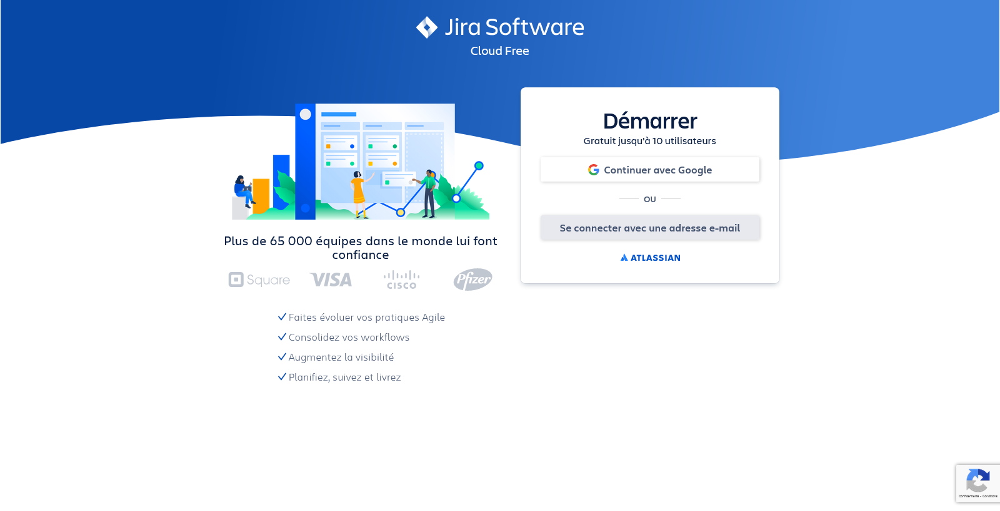
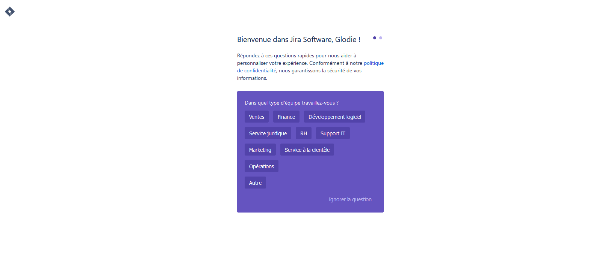
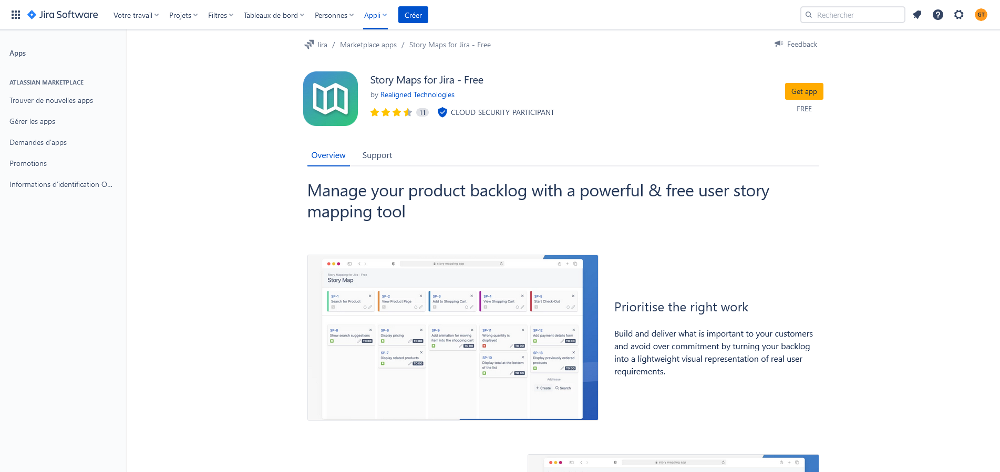

# JIRA : logiciel de gestion de projet agile

---

## Mise en place

1. Dans chaque groupe, désignez un responsable qui va prendre en charge la création d'un projet agile sur Jira.

---

### Tout le monde sauf le responsable

2. Créez un compte en suivant [lien suivant](https://id.atlassian.com/signup)

---

### Uniquement le responsable

3. Créez un compte et un projet Jira en suivant les indications ci-après.

- [Lien pour créer un compte et un projet Jira](https://www.atlassian.com/fr/software/jira/free)

- Appuyez-vous sur les illustrations d'images ci-après pour effectuer les opérations attendues.

#### Création du compte

#### Validation du compte

#### Configuration du projet

#### Invitations des collaborateurs

4. Effectuez les invitations :
- Invitez les autres membres du groupe en saisissant leurs e-mails de leur compte sur Jira.
- Invitez également le formateur `contact@tshimini.fr` à collaborer dans ce projet.

#### Ajout des extensions

5. Ajoutez les extensions suivantes :
- Extension *Story mapping*

- Extension *Planning Poker*
